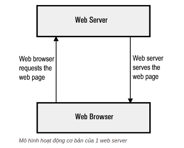
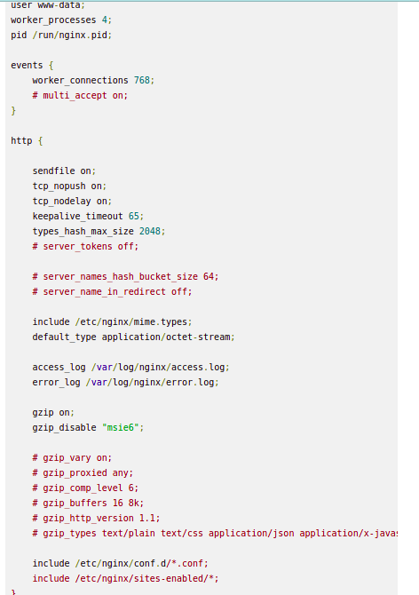
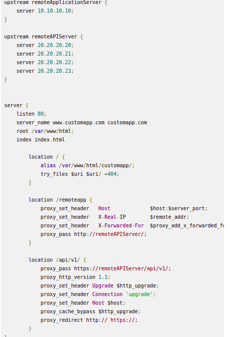

# Web server
+ Web server là máy chủ cài đặt các chương trình phục vụ các ứng dụng web.
+  Webserver có khả năng **tiếp nhận request** từ các trình duyệt web và gửi phản hồi đến client thông qua giao thức HTTP hoặc các giao thức khác
+  Có nhiều web server khác nhau như: Apache, **Nginx**, IIS, … Web server thông dụng nhất hiện nay:

## Nginx
+ NGINX là một web server mạnh mẽ mã nguồn mở. Nginx sử dụng kiến trúc đơn luồng, hướng sự kiện vì thế nó hiệu quả hơn Apache server.
+ Những tính năng của máy chủ HTTP Nginx:
  + Có khả năng xử lý hơn 10.000 kết nối cùng lúc với bộ nhớ thấp.
  + Tăng tốc reverse proxy bằng bộ nhớ đệm (cache), cân bằng tải đơn giản và khả năng chịu lỗi.
  + Hỗ trợ mã hoá SSL và TLS
  + ...
+ Cài đặt NGINX:
  + Có 2 cách để cài đặt NGINX, có thể sử dụng gói (package) dựng sẵn hoặc cài đặt từ source.
  + Phương thức đầu tiên dễ và nhanh hơn, nhưng cài đặt từ source cung cấp khả năng cài đặt thêm các module khác giúp NGINX mạnh mẽ hơn. Nó cho phép chúng ta tùy chỉnh cho phù hợp với nhu cầu của ứng dụng
  + `sudo apt-get update , sudo apt-get install nginx , sudo nginx -v`
  + Webserver mới sẽ được cài đặt tại **/etc/nginx/**. Nếu bạn vào trong thư mục này, bạn sẽ thấy nhiều tệp tin và thư mục.
  + Nhưng thứ quan trọng nhất cần chú ý là tệp tin nginx.conf và thư mục sites-available.

+ Cấu hình Nginx.
  
  + Tệp tin nginx.conf được cấu trúc thành các ngữ cảnh. Đầu tiên là events, và thứ 2 là http.
  + Nhiều thứ trong tệp tin này có thể tinh chỉnh dựa theo nhu cầu của bạn, nhưng bạn cũng có thể sử dụng các thiết lập mặc định:
    + **worker_processes**: Thiết lập này định nghĩa số worker processes mà NGINX sẽ sử dụng. Bởi vì NGINX là đơn luồng (single threaded), nó thường bằng với số lõi CPU.
    + **worker_connection**: Đây là số lượng tối đa của các kết nối đồng thời cho mỗi worker process và nói cho các worker process của chúng ta có bao nhiêu người có thể được phục vụ đồng thời bởi NGINX
    + **access_log** & **error_log**: Đây là những tệp tin mà NGINX sẽ sử dụng để log bất kỳ lỗi và số lần truy cập. Các bản ghi này thường được sử dụng để gỡ lỗi hoặc sửa chữa.
    + **gzip**: Đây là các thiết lập nén GZIP của các NGINX reponse
  + NGINX có thể hỗ trợ nhiều hơn một website, và các tệp tin định nghĩa các trang web của bạn ở trong thư mục **_/etc/nginx/sites-available_**
  + Thư mục site-available bao gồm các cấu hình cho các host ảo (virtual host).
  + Nó cho phép web server có thể cấu hình cho nhiều trang web với các cấu hình riêng biệt.
  + Các trang web trong thư mục không live và chỉ được cho phép nếu chúng ta tạo một symlink tới thư mục sites-enabled.
  + Bạn có thể tạo một tệp tin mới cho ứng dụng của mình hoặc chỉnh sửa một tệp tin mặc định. Một cấu hình thông thường sẽ như dưới đây:
  
  
    + Giống như nginx.conf, nó cũng sử dụng khái niệm các ngữ cảnh lồng nhau (và tất cả cũng được lồng trong ngữ cảnh HTTP CỦA nginx.conf, vì thế chúng cũng kế thừa mọi thứ từ nó).
    + Ngữ cảnh **server** định nghĩa một server ảo để xử lý các request từ client của bạn. Bạn có thể có nhiều khối server, và NGINX sẽ chọn một trong số chúng dựa trên các chỉ thị _listen_ và _server_name_.
    + Trong một khối server, chúng ta định nghĩa nhiều ngữ cảnh **location** được sử dụng để quyết định cách xử lý các request từ client. Bất cứ khi nào một request đến, NGINX sẽ thử khớp URI tới một trong số các định nghĩa location và xử lý nó cho phù hợp.
    + Có nhiều chỉ thị quan trọng có thể được sử dụng dưới ngữ cảnh **location**, chẳng hạn như:
      + **try_files**: sẽ cố gắng phục vụ các tệp tin tĩnh được tìm thấy trong thư mục được trỏ tới bởi chỉ thị gốc.
      + **proxy_pass** sẽ gửi request tới một proxy server cụ thể.
      + **rewrite** sẽ viết lại URI tới dựa trên một regular expression để một khối location có thể xử lý nó

# Command
```commandline
# check lỗi syntax nginx 
sudo nginx -t

# Start, stop, restart nginx using systemctl
sudo systemctl start nginx
sudo systemctl stop nginx
sudo systemctl restart nginx

# Job for nginx.service failed because the control process exited with error code.
sudo fuser -k 80/tcp
sudo fuser -k 443/tcp
sudo systemctl restart nginx

# To ensure your firewall is active
+ sudo systemctl start ufw
+ sudo ufw status # xem cac port dc mo
+ sudo ufw allow port/tpc ( or udp )  de mo port

# Run certbot
sudo certbot -d stream.clover.greenlabs.ai
sudo certbot --nginx -d example.com -d www.example.com

```


#Let's Encrypt 
+ Let’s Encrypt là **một cơ quan cung cấp chứng chỉ TLS / SSL** miễn phí thông qua giao thức ACME (Môi trường quản lý chứng chỉ tự động) và được phát triển bởi ISRG (Nhóm nghiên cứu bảo mật Internet)
+ Let’s Encrypt cung cấp cho người dùng một chứng nhận số phù hợp để kích hoạt HTTPS (có thể là TLS hoặc SSL) cho trang web của mình một cách thân thiện và hoàn toàn miễn phí.
+ Tất cả điều này nhằm đảm bảo một môi trường sử dụng website riêng tư, an toàn và tôn trọng giữa người dùng với nhau.

### Các loại chứng chỉ SSL 
+ Let’s Encrypt hiện đang cung cấp 2 loại chứng chỉ phổ biến gồm:
    + SSL ký tự đại diện.
    + SSL tên miền đơn tiêu chuẩn (gồm cả tên miền chính và các tên miền phụ liên quan)
  
+ Các loại chứng chỉ SSL đều có thời hạn hoạt động là 90 ngày (tự động gia hạn) và được cài đặt trên các máy chủ của bạn.

### Let’s Encrypt hoạt động như thế nào?
+ Bước 1: Xác nhận tên miền
+ Bước 2: Cấp chứng chỉ và thu hồi

### Certbot
+ Certbot là một ứng dụng Let’s Encrypt phổ biến nhất và có trong hầu hết các bản phân phối Linux chính, bao gồm khả năng cấu hình tự động thuận tiện cho Apache và Nginx.
+ Sau khi cài đặt, tìm nạp chứng chỉ và cập nhật cấu hình Apache của bạn và thực hiện giống như sau:
  + `sudo certbot –apache(–nginx) -d www.example.com` 
+ Vì chứng chỉ Let’s Encrypt chỉ có giá trị trong 90 ngày, nên điều quan trọng là phải thiết lập quy trình gia hạn tự động. Ghi lệnh `sudo certbot renew` sẽ gia hạn tất cả các chứng chỉ trên máy.
### Một số ứng dụng khác : lego, acme.sh, Caddy, ..

# SSL/TLS và giao thức https


# REF
+ https://viblo.asia/p/streaming-videos-server-su-dung-nginx-rtmp-va-hls-maGK7q4Llj2
+ [Let's Encrypt](https://prodima.vn/lets-encrypt-la-gi/)
+ [nginx](https://topdev.vn/blog/nginx-la-gi/)
+ [webserver](https://topdev.vn/blog/nginx-la-gi/)
+ https://stackoverflow.com/questions/35868976/nginx-service-failed-because-the-control-process-exited


# Example
+ Create file conf nginx in `/etc/nginx/sites-enabled`
```
    server {
    #    if ($host = stream-clover-q2.greenlabs.ai) {
    #       return 301 https://$host$request_uri;
    #    } # managed by Certbot
        listen 80;
        server_name stream-test.greenlabs.ai;
        return 301 https://$host$request_uri;
    }
    server {
            listen 443 ssl ;
            server_name stream-test.greenlabs.ai;
            ssl_protocols TLSv1.2;
    
            ssl_ciphers 'ECDHE-RSA-AES128-GCM-SHA256:ECDHE-ECDSA-AES128-GCM-SHA256:ECDHE-RSA-AES256-GCM-SHA384:ECDHE-ECDSA-AES256-GCM-SHA384:DHE-RSA-AES128-GCM-SHA256:DHE-DSS-AES128-GCM-SHA256:kEDH+AESGCM:ECDHE-RSA-AES128-SHA256:ECDHE-ECDSA-AES128-SHA256:ECDHE-RSA-AES128-SHA:ECDHE-ECDSA-AES128-SHA:ECDHE-RSA-AES256-SHA384:ECDHE-ECDSA-AES256-SHA384:ECDHE-RSA-AES256-SHA:ECDHE-ECDSA-AES256-SHA:DHE-RSA-AES128-SHA256:DHE-RSA-AES128-SHA:DHE-DSS-AES128-SHA256:DHE-RSA-AES256-SHA256:DHE-DSS-AES256-SHA:DHE-RSA-AES256-SHA:AES128-GCM-SHA256:AES256-GCM-SHA384:AES128-SHA256:AES256-SHA256:AES128-SHA:AES256-SHA:AES:CAMELLIA:DES-CBC3-SHA:!aNULL:!eNULL:!EXPORT:!DES:!RC4:!MD5:!PSK:!aECDH:!EDH-DSS-DES-CBC3-SHA:!EDH-RSA-DES-CBC3-SHA:!KRB5-DES-CBC3-SHA';        
    
            location /stream/cam_360_554.flv {
            # Backend server to forward requests to/from
            proxy_pass          http://192.168.111.133:55557/stream/cam_360_554.flv;
        proxy_http_version 1.1;
            proxy_set_header X-Real-IP $remote_addr;
        proxy_set_header Connection "";
    
            proxy_set_header Host $host;
            proxy_set_header X-Forwarded-For $proxy_add_x_forwarded_for;
            proxy_set_header X-Forwarded-Port "";
            proxy_set_header X-Forwarded-Proto https;
            }
    #    ssl_certificate /etc/letsencrypt/live/stream-clover-q2.greenlabs.ai/fullchain.pem; # managed by Certbot
    #    ssl_certificate_key /etc/letsencrypt/live/stream-clover-q2.greenlabs.ai/privkey.pem; # managed by Certbot
    }
```
+ sudo certbot --nginx -d stream-clover-manager.greenlabs.ai (create domain)
+ sudo nginx -t (check syntax file nginx)
+ sudo nginx -s reload (reload file nginx)

# CORS with https api and config nginx
